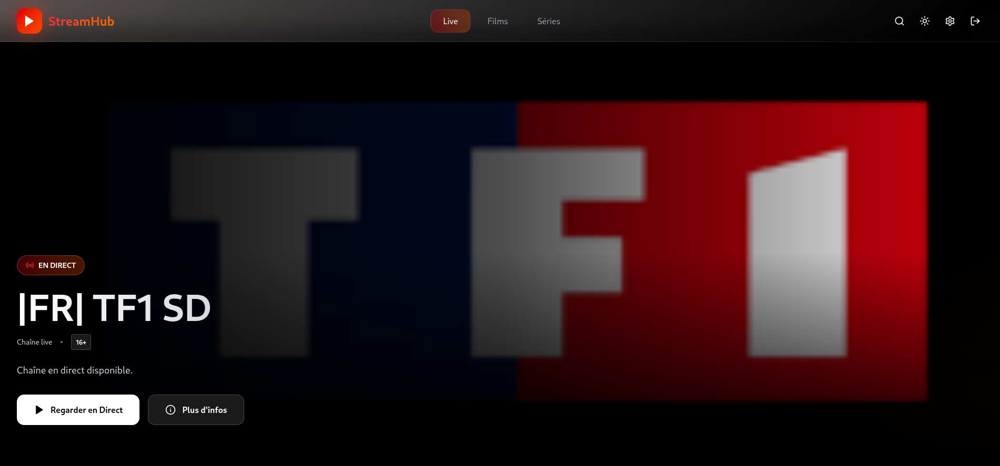
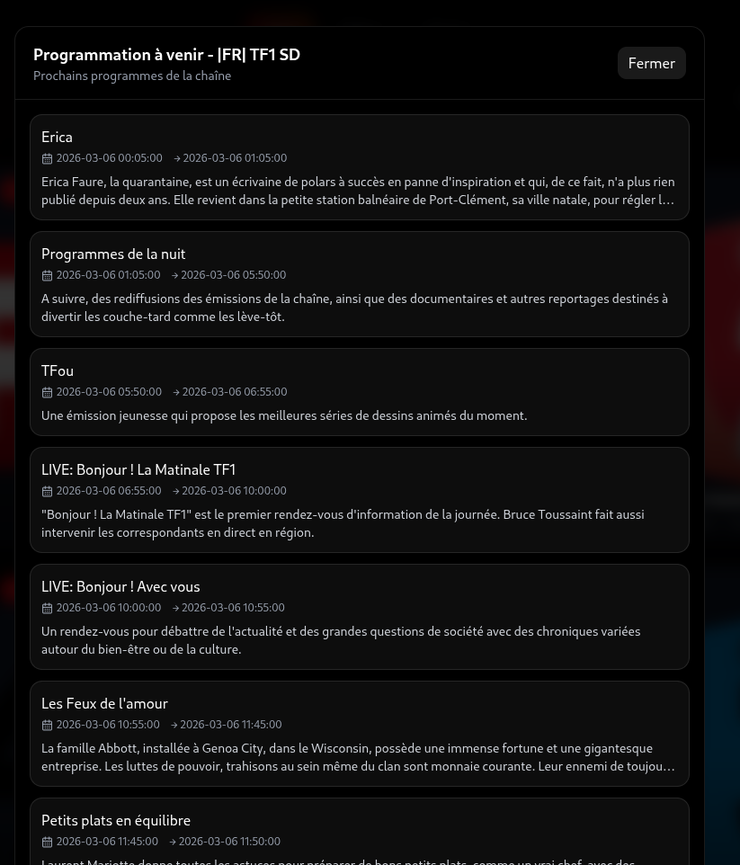
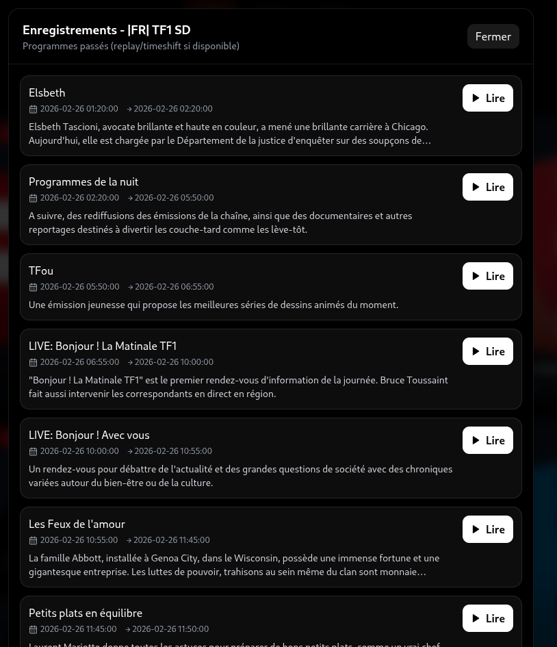
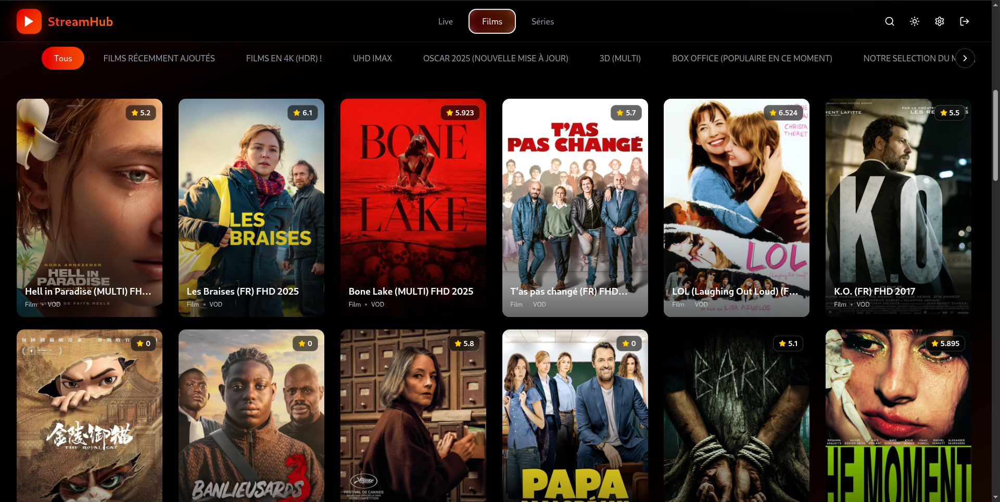
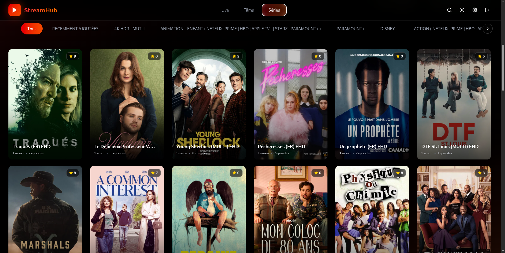
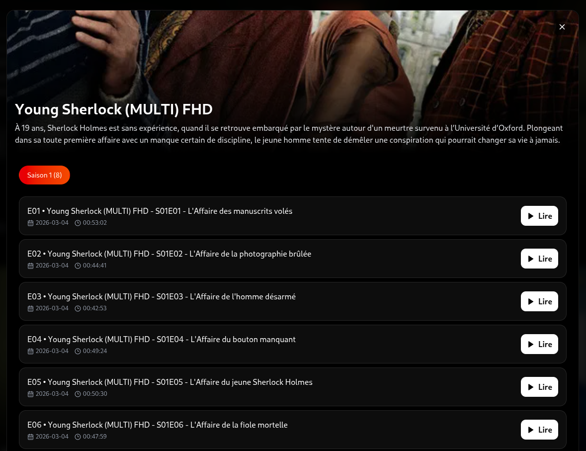

# IPTV Player Web

Modern web IPTV player compatible with the Xtream Codes API.

---

## Table of Contents

- [Overview](#overview)
- [Current Features](#current-features)
- [Upcoming Features (Roadmap)](#upcoming-features-roadmap)
- [Screenshots](#screenshots)
- [Project Structure](#project-structure)
- [Prerequisites](#prerequisites)
- [Run Locally (Machine)](#run-locally-machine)
- [Run with Docker](#run-with-docker)
- [Run with Docker Compose](#run-with-docker-compose)
- [CI/CD Docker Hub (GitHub Actions)](#cicd-docker-hub-github-actions)
- [Environment Variables](#environment-variables)
- [Acknowledgements](#acknowledgements)
- [Legal Warning](#legal-warning)
- [Issues & Pull Requests](#issues--pull-requests)
- [License](#license)

---

## Overview

This project lets you connect to an Xtream-compatible IPTV provider, browse **Live / VOD / Series** content, and play streams from a web interface.

The backend handles authentication, IPTV account security, data retrieval, and multiple playback modes (direct, proxy, transcoding).

---

## Current Features

### Frontend

- User authentication (register / login).
- Multiple IPTV account management (add + select).
- Section-based navigation: **Live**, **Movies (VOD)**, **Series**.
- Dynamic categories based on the selected IPTV account.
- Text search on current content.
- “Load more” pagination in the UI.
- Detailed series view:
  - seasons,
  - episodes,
  - metadata (duration, date, rating, etc.).
- Video player with multiple candidate/fallback sources.
- Live EPG:
  - upcoming schedule,
  - past programs (recordings/replay).
- Dark / light mode.

### Backend

- Fastify API (Node.js + TypeScript).
- JWT authentication.
- User password hashing.
- IPTV password encryption.
- Local SQLite database.
- Categories/content/series cache with TTL.
- Xtream endpoints:
  - categories,
  - content,
  - EPG,
  - series info.
- Video playback:
  - direct URL,
  - stream proxy,
  - replay/timeshift,
  - FFmpeg transcoding (example: MKV to MP4).
- Health endpoint: `/health`.

---

## Upcoming Features (Roadmap)

> This roadmap lists the next planned improvements for the project.

- [x] Favorites (channels, movies, series, episodes).
- [ ] "TvParty" mode for synchronized multi-viewer watching.
- [x] Docker images release
- [ ] Enriched context using the IMDB API.
- [ ] Watch history and automatic resume.
- [ ] Advanced filters (genre, year, rating, resolution).
- [ ] Enhanced sorting (popularity, added date, alphabetical).
- [ ] Advanced player settings (quality, buffer, external subtitles).
- [ ] Internationalization (FR/EN).
- [ ] Better backend observability (structured logs + metrics).

---

## Screenshots

Screenshots currently available in `screenshot/`:

### Live






### VOD



### Series




---

## Project Structure

```text
.
├── frontend/   # React + Vite
├── backend/    # Fastify + SQLite
└── docker-compose.yml
```

---

## Prerequisites

- Node.js 22+
- npm 10+
- Docker (optional)
- Docker Compose (optional)
- FFmpeg (recommended for some playback/transcoding scenarios outside containers)

---

## Run Locally (Machine)

### 1) Clone

```bash
git clone <YOUR_REPO_URL>
cd git_version
```

### 2) Backend

```bash
cd backend
cp .env.example .env
npm install
npm run dev
```

Backend available at `http://localhost:4000`.

### 3) Frontend (new terminal)

```bash
cd frontend
cp .env.example .env
npm install
npm run dev
```

Frontend available at `http://localhost:5173`.

---

## Run with Docker

### Backend (Docker)

```bash
cd backend
cp .env.example .env
docker build -t iptv-backend .
docker run --rm -p 4000:4000 --env-file .env iptv-backend
```

### Frontend (Docker)

```bash
cd frontend
docker build --build-arg VITE_API_BASE_URL=http://localhost:4000 -t iptv-frontend .
docker run --rm -p 8080:80 iptv-frontend
```

Frontend available at `http://localhost:8080`.

---

## Run with Docker Compose

From the project root:

```bash
cp backend/.env.example backend/.env
docker compose up --build
```

Services:

- Frontend: `http://localhost:8080`
- Backend: internal compose service (healthcheck on `/health`)

To stop:

```bash
docker compose down
```
---

## Environment Variables

### Backend (`backend/.env`)

- `PORT` (default: `4000`)
- `HOST` (default: `0.0.0.0`)
- `JWT_SECRET`
- `APP_ENCRYPTION_SECRET` (minimum 32 characters)
- `CORS_ORIGIN`
- `CACHE_TTL_SECONDS`
- `DB_PATH` (optional depending on environment)

### Frontend (`frontend/.env`)

- `VITE_API_BASE_URL` (example: `http://localhost:4000`)

---

## Acknowledgements

I was inspired by the following project:

- https://github.com/Youri666/Xtream-m3u_plus-IPTV-Player.git

Big thanks to the original author for the initial work and inspiration.

---

## Legal Warning

⚠️ **IMPORTANT**

This project is provided **for development, learning, and testing purposes only**.

I am **not responsible** for how users use their IPTV subscriptions, playlists, or streams.

Each user is responsible for:

- ensuring the legality of the content they access,
- complying with copyright laws and regulations in their country,
- not using this project for illegal activities.

---

## Issues & Pull Requests

Contributions are welcome.

### Open an Issue

Please include:

1. **Context** (OS, browser, Node/Docker version)
2. **Reproduction steps**
3. **Expected result**
4. **Actual result**
5. **Logs / screenshots**

### Submit a Pull Request

1. Fork the repository
2. Create a branch:

```bash
git checkout -b feat/my-feature
```

3. Create clean and atomic commits
4. Open the PR with:
   - objective,
   - main changes,
   - before/after screenshots for UI changes,
   - specific review points.

### PR Best Practices

- No secrets in commits (`.env`, tokens, credentials)
- Keep existing code style
- Focused change set (avoid out-of-scope refactors)
- Update documentation when needed

---

## License

This project is licensed under the MIT license. See the `LICENSE` file for more information.
